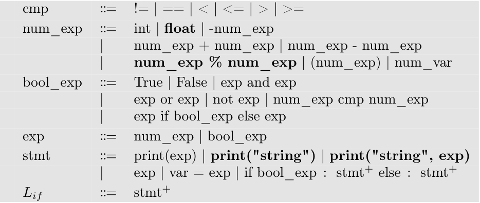

# Aporia AST

This package compiles a subset of Python to [Aporia](https://github.com/EphraimSiegfried/aporia). The Aporia language is described in [this paper](https://www.arxiv.org/abs/2411.05570).

The Backus-Naur-Form Grammar of the Python source language subset is specified here:



## Installation

You can install the package with

```bash
pip install aporiapy
```

## Usage

### Command Line Interface

You can use the compiler via the command line interface

```bash
aporiapy file_to_be_compiled.py
```
This will generate an spp file containing the Aporia source code. Additional options can be found with `aporiapy -h`


## Contributing

Dependency management and the publishing of packages is managed by [uv](https://github.com/astral-sh/uv).
You can install it with `pip install uv`. The interpreter can be run with `uv run aporiapy`

## Acknowledgements

This project builds upon the work done in the seminar Interpretation and Compilation of Programming Languages at the University of Basel. Thanks to the contributions of Ruben Hutter, Luca Gloor, and Ephraim Siegfried, as well as the guidance from the seminar instructors Ali Ajorian and Erick Lavoie.
